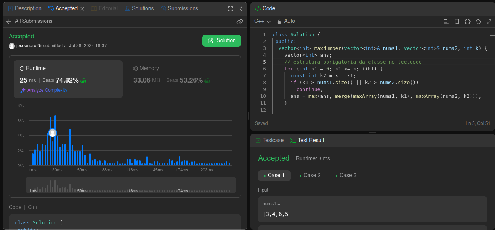
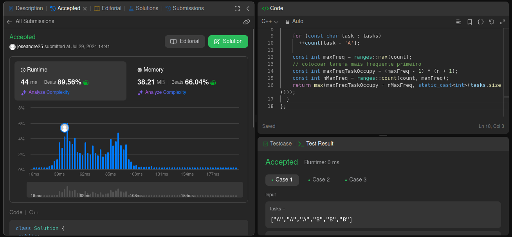

# Questões - Juíz Online

**Número da Lista**: X<br>
**Conteúdo da Disciplina**: Greedy Algorithms<br>

## Alunos

| Matrícula  | Aluno                               |
| ---------- | ----------------------------------- |
| 21/1062016 | José André Rabelo Rocha |
| 20/0020323 | Jefferson Sena Oliveira         |

## Apresentação
A apresentação pode ser vista no YouTube por meio do link: https://youtu.be/n-3rDOvzQDM?si=C6j847L2hA2EzO23

## Sobre

Este projeto consiste na realização de exercícios de plataformas de juízes eletrônicos. Serão desenvolvidos problemas de média e alta
complexidade com ênfase nos conteúdos vistos no módulo de algoritmos ambiciosos. 

## Screenshots

#### Exercício 01 - Create Maximum Number

Dificuldade: Difícil <br>
Descrição do Problema: [321. Create Maximum Number
](https://leetcode.com/problems/create-maximum-number/description/)<br>
Solução Proposta: [Código de Solução](https://github.com/projeto-de-algoritmos-2024/Greedy_Algorithm_LeetCode/blob/master/Create_Maximum_Number/maximum_number.cpp)



#### Exercício 02 - Task Scheduler

Dificuldade: Média <br>
Descrição do Problema: [621. Task Scheduler](https://leetcode.com/problems/task-scheduler/description/)<br>
Solução Proposta: [Código de Solução](https://github.com/projeto-de-algoritmos-2024/Greedy_Algorithm_LeetCode/blob/master/Task_Scheduler/task_scheduler.cpp) 



#### Exercício 03 - X

Dificuldade: Difícil <br>
Descrição do Problema: [630. Course Schedule III](https://leetcode.com/problems/course-schedule-iii/description/)<br>
Solução Proposta: [Código de Solução](https://github.com/projeto-de-algoritmos-2024/Greedy_Algorithm_LeetCode/blob/master/course_schedule_III/course_schedule_III.py) 


#### Exercício 04 - X

Dificuldade: Médio <br>
Descrição do Problema: [1029. Two City Scheduling](https://leetcode.com/problems/two-city-scheduling/description/)<br>
Solução Proposta: [Código de Solução](https://github.com/projeto-de-algoritmos-2024/Greedy_Algorithm_LeetCode/blob/master/two_city_scheduling/two_city_scheduling.py) 


## Instalação

**Linguagem**: <br>
<!-- **Framework**: (caso exista)<br> -->
Descreva os pré-requisitos para rodar o seu projeto e os comandos necessários.

## Uso

Instruções para compilar e executar o código C++:

1. Certifique-se de ter um compilador para C e C++ instalado em sua máquina. Recomendamos o gcc.

2. Faça o clone do repositório Git para o seu ambiente local.

3. No terminal, navegue até o diretório onde está localizado o arquivo de código-fonte (.cpp ou .c) que deseja compilar.

4. - Compile o arquivo de código-fonte utilizando o seguinte comando:
```g++ <nome-do-arquivo.cpp> -o <nome-do-executavel> ```
Substitua <nome-do-executavel> pelo nome desejado para o executável e <nome-do-arquivo.cpp> pelo nome do arquivo de código-fonte.
    - Para a execução em C: Compile o arquivo de código-fonte utilizando o seguinte comando:
```gcc <nome-do-arquivo.c> -o <nome-do-executavel> ```
Substitua <nome-do-executavel> pelo nome desejado para o executável e <nome-do-arquivo.cpp> pelo nome do arquivo de código-fonte.

5. Após a compilação bem-sucedida, execute o programa com o seguinte comando:
```./<nome-do-executavel>```
Certifique-se de estar no diretório correto em seu terminal para executar o programa.

6. Opcional: Deixamos arquivos de entrada para casos de teste (por exemplo, in.txt). Assim, você pode redirecionar a entrada para o programa durante a execução. Por exemplo:
```./<nome-do-executavel> < <nome-do-arquivo-de-input>.txt```

<!--## Outros

Quaisquer outras informações sobre seu projeto podem ser descritas abaixo.

-->
